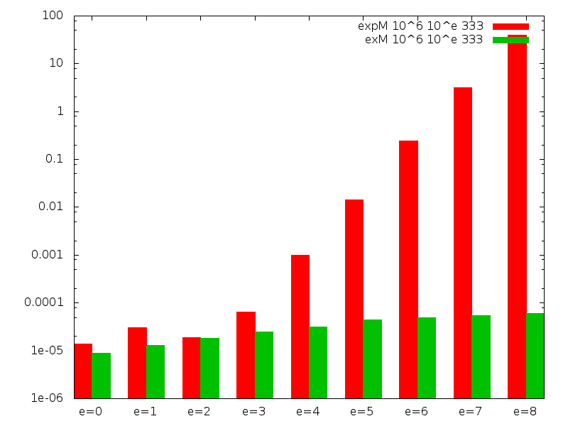

# Assignment 6

## Exercise 1
See the end of `Lecture6.hs`.

## Exercise 2
Below is a graph that compares the performance of the original `expM` and
our implementation of `exM`. The y-axis is a logscale of the execution time in
seconds, you can interpret the x-axis as a "logscale of the exponent".

*DOUBLE CHECK PLS*
*It looks like the original `expM` grows linearly with the size of the
exponent; if the exponent is multiplied by 10, `expM` takes 10 times
longer. `exM` seems to grow logarithmically with the size of the exponent; if
the exponent is multiplied by 10, `exM` takes perhaps 2 times longer.*

## Exercise 3
See `Composites.hs`

## Exercise 4
Run `Lecture6_4.hs` to get the least composites that pass the fermat test
with `elem k [1..3]`. If you increase `k` the test is less likely to
pass for false positives because it tests more numbers.

## Exercise 5
The definition of Carmichael numbers is that they adhere to Fermat's
Little Theorem but they are not prime numbers. Therefore, if you run the
test enough times with the Carmichael, you will always find that the smallest
Carmichael number is the least false positive.

## Exercise 6
The Miller-Rabin method performs better on Carmichael numbers, therefore
the Least-False-Positive test of exercise 6 is slower than exercise 5.

## Exercise 7
To test that we got the right Mersenne primes we compared them with the
numbers given in the `Lecture6.hs` file. We found that a precision of 1
frequently gives you false positives while a precision of 10 performs
better.
